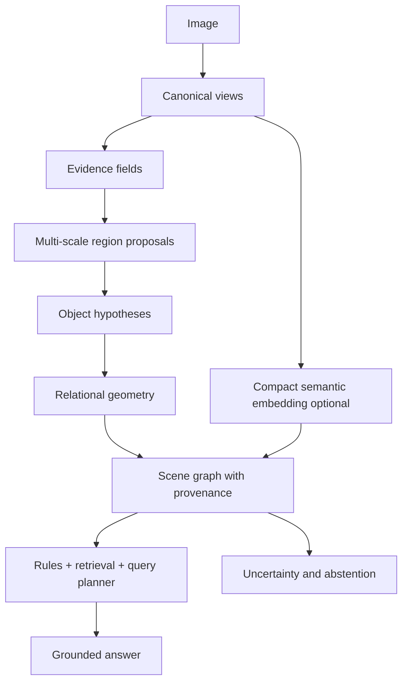

# HeraVision Next: Arsitektur Evidence-First

## Gagasan utama

Kita tidak akan mencoba membuat satu fungsi `image -> label` yang berpura-pura memahami dunia. Kita akan membuat sistem `image -> evidence field -> hypotheses -> scene graph -> grounded answer`. Perbedaan ini penting: sistem dapat menunjukkan apa yang terlihat, apa yang disimpulkan, dan bagian mana yang tidak dapat dipastikan.

Arsitektur ini memisahkan tiga hal yang sering tercampur dalam model vision besar:

| Lapisan | Fungsi | Bentuk output |
|---|---|---|
| Persepsi | Mengukur sinyal dari pixel | Field, keypoint, contour, region, descriptor |
| Konsistensi | Menggabungkan sinyal menjadi hipotesis | Candidate object, depth order, relation score |
| Semantik | Memberi nama, menjawab pertanyaan, memakai prior | Scene graph, retrieval, grounded text |

## Flow utama



## 1. Canonical views

Untuk gambar RGB `I(x,y)`, buat beberapa view yang tidak mahal:

1. Luminance `Y = 0.2126R + 0.7152G + 0.0722B`.
2. Log-chroma `C_r = log(R+ε) - log(Y+ε)` dan `C_b = log(B+ε) - log(Y+ε)` untuk memisahkan warna dari brightness.
3. Gaussian pyramid `I_s` pada beberapa skala.
4. Gradient magnitude dan orientation dari Sobel/Scharr.
5. Laplacian-of-Gaussian atau Difference-of-Gaussians untuk struktur multi-skala.
6. Local texture descriptor, misalnya uniform LBP atau histogram orientation pada patch.
7. Frequency summary ringan melalui block-DCT bila eksperimen menunjukkan manfaat untuk material/tekstur.

Semua view harus memiliki koordinat kembali ke gambar asli. Tidak boleh ada feature yang kehilangan provenance pixel/region.

## 2. Evidence field

Untuk setiap pixel atau cell grid, simpan vektor evidence:

```text
E(x,y) = [edge, corner, orientation, chroma, texture,
          flatness, saliency, saturation, local_contrast]
```

Edge dan orientation diambil dari gradient. Flatness adalah kebalikan variasi lokal. Texture diperoleh dari statistik patch, bukan label semantik. Saliency diperlakukan sebagai prior perhatian, bukan bukti objek.

Gunakan normalisasi robust per gambar. Untuk feature `f`, contoh normalisasi:

```text
z_f(x,y) = clamp((f(x,y) - median(f)) / (MAD(f) + ε), -zmax, zmax)
```

Pendekatan median/MAD lebih tahan terhadap exposure ekstrem dibanding mean/std. Semua threshold awal harus disimpan sebagai konfigurasi dan diuji melalui sensitivity analysis.

## 3. Region formation

Daripada langsung menganggap setiap connected component sebagai objek, bentuk region melalui graph pada pixel atau superpixel ringan. Setiap node adalah cell/pixel cluster. Edge antara `i` dan `j` memiliki cost:

```text
w(i,j) = α·|Y_i - Y_j|
       + β·Δchroma(i,j)
       + γ·texture_distance(i,j)
       + δ·edge_barrier(i,j)
       + η·scale_inconsistency(i,j)
```

Region digabung bila cost rendah dan dipisahkan bila edge barrier tinggi. Parameter `α..η` tidak boleh dianggap universal; ia dipelajari/dituning berdasarkan domain dan diuji pada domain lain.

Untuk menghindari ledakan kombinatorial, gunakan dua tahap:

1. Over-segmentation konservatif untuk mempertahankan boundary.
2. Region merging berbasis cost, compactness, dan konsistensi lintas skala.

Setiap region menyimpan mask atau polygon terkompresi, bounding box, centroid, area, perimeter, convexity, color statistics, texture statistics, dan daftar evidence source.

## 4. Object hypotheses

Region belum tentu objek. Buat hipotesis objek `h` dari region atau gabungan region dengan feature:

```text
φ(h) = [area_ratio, aspect_ratio, compactness, solidity,
        color_hist, texture_hist, gradient_hist,
        boundary_strength, scale_stability, symmetry,
        context_features]
```

Skor hipotesis tidak perlu langsung berupa probabilitas sempurna. Gunakan log-evidence yang dapat diaudit:

```text
S(h | E) = b_type
         + Σ_k w_k · e_k(h)
         - λ_complexity · C(h)
         - λ_conflict · X(h)
```

`e_k(h)` adalah dukungan cue seperti boundary, interior coherence, scale stability, dan context. `C(h)` menghukum hipotesis yang terlalu rumit. `X(h)` menghukum konflik, misalnya boundary tidak tertutup tetapi hipotesis dipaksa menjadi objek padat.

Gunakan beberapa proposal generator—contour, color region, texture region, symmetry, dan optional compact encoder—lalu lakukan deduplication berdasarkan mask IoU dan descriptor distance. Hasil akhirnya bukan satu label tunggal, melainkan top-k hypothesis dengan score dan bukti.

## 5. Geometri dan relasi

Untuk pasangan region/objek `a,b`, hitung feature relasi:

```text
r(a,b) = [dx, dy, distance, overlap,
          containment, boundary_contact,
          occlusion_cue, alignment, scale_ratio,
          color/texture compatibility]
```

Relasi eksplisit dapat diturunkan dari geometri:

- `left_of`, `right_of`, `above`, `below` dari centroid dan overlap.
- `inside` dari containment mask/bounding polygon.
- `touching` dari jarak boundary.
- `overlapping` dari mask IoU.
- `aligned_with` dari keselarasan principal axis.
- `behind/in_front_of` dari T-junction, boundary continuation, dan occlusion cue.
- `supports` dari horizontal contact, vertical ordering, dan shape compatibility.

Relasi memiliki dua status:

```text
visible_relation: evidence langsung dari geometry/pixel
inferred_relation: hasil prior atau common-sense rule
```

Keduanya tidak boleh digabung tanpa tag karena `man holding cup` memerlukan bukti yang berbeda dari `cup probably belongs to man`.

## 6. Scene graph dengan provenance

Representasi inti:

```json
{
  "nodes": [
    {
      "id": "r17",
      "hypotheses": [
        {"label": "person", "score": 0.71},
        {"label": "statue", "score": 0.22}
      ],
      "region": {"bbox": [x, y, w, h], "mask_ref": "mask-17"},
      "evidence": ["boundary", "texture", "pose-like-symmetry"],
      "uncertainty": 0.29
    }
  ],
  "edges": [
    {
      "from": "r17",
      "to": "r22",
      "relation": "holding",
      "status": "inferred",
      "score": 0.58,
      "evidence": ["contact", "relative-position", "retrieved-prior"]
    }
  ]
}
```

Scene graph harus dapat menjawab pertanyaan: “region mana yang mendukung kalimat ini?” Jika tidak ada path evidence, output bahasa harus menggunakan kata probabilistik atau abstain.

## 7. Semantic prior yang murah

Kita siapkan tiga mode runtime:

| Mode | Semantic prior | Target |
|---|---|---|
| `pure` | Tidak ada neural model | CPU paling lemah, geometry/material/region |
| `compact` | Encoder kecil terkuantisasi | Open-vocabulary label dan retrieval |
| `hybrid` | Encoder kecil + graph/rules | Kualitas terbaik dalam profil CPU |

Encoder kecil seperti MobileCLIP/MobileNet-style backbone boleh menjadi baseline atau prior, tetapi bukan sumber kebenaran tunggal. Embedding hanya memberi similarity prior:

```text
prior(label | region) ∝ exp(cosine(z_region, z_label) / τ)
```

Prior semantic harus dikalikan dengan evidence visual dan dapat dikalahkan oleh kontradiksi geometry. Bila embedding yakin tetapi boundary/region tidak mendukung, sistem harus menandai konflik, bukan memaksa label.

## 8. Query planning dan reasoning

Pertanyaan visual dipecah menjadi operasi graph:

```text
question -> entity constraints -> relation traversal
         -> evidence filter -> answer candidates
         -> confidence calibration -> grounded response
```

Contoh: “Apa yang berada di atas meja?” menjadi pencarian node `table`, lalu semua node dengan relasi `above`/`supported_by`, kemudian filter berdasarkan overlap dan vertical contact. Ini lebih murah dan lebih dapat diaudit daripada mengirim gambar penuh ke decoder besar.

Untuk pertanyaan yang memerlukan prior dunia, gunakan rule engine dengan status eksplisit:

```text
if visible(a, cup) and near(a, hand) and contact(a, hand):
    suggest(holding(hand, cup), confidence=0.55)
```

Rule semacam ini tidak boleh mengubah inference menjadi fakta observasi. Evidence, prior, dan conclusion harus tetap terpisah.

## 9. Uncertainty dan abstention

Untuk kandidat label `p_1..p_n`, gunakan entropy yang dinormalisasi:

```text
H(p) = -Σ_i p_i log(p_i) / log(n)
```

Confidence akhir harus mempertimbangkan:

```text
Q = calibration(score)
    · stability_across_scale
    · stability_under_crop
    · evidence_coverage
    · (1 - conflict_rate)
```

Jika `Q < τ_answer`, engine mengembalikan “tidak cukup bukti” beserta region ambigu dan eksperimen berikutnya yang disarankan, misalnya crop lebih besar, OCR, atau permintaan konteks tambahan.

## 10. Iterative refinement

Pipeline awal mengeluarkan hypotheses, bukan berhenti pada first guess. Refinement memilih region yang paling informatif menurut:

```text
value(crop) = expected_uncertainty_reduction(crop)
             / estimated_compute_cost(crop)
```

Crop/refinement dapat berupa peningkatan resolusi lokal, pengukuran texture tambahan, atau semantic embedding hanya pada region ambigu. Dengan cara ini, CPU tidak membayar komputasi mahal untuk seluruh gambar.

## Prinsip implementasi

1. Semua evidence memiliki koordinat dan provenance.
2. Semua semantic label dapat ditolak oleh evidence conflict.
3. Semua threshold dapat dikalibrasi dan diuji pada domain lain.
4. Semua output menyatakan uncertainty; tidak ada confidence palsu.
5. CPU budget dialokasikan adaptif berdasarkan information gain.
6. Neural component bersifat optional dan terisolasi dari core graph/reasoning.
7. Benchmark menilai kualitas, latensi, memory, energy proxy, dan calibration secara bersamaan.
